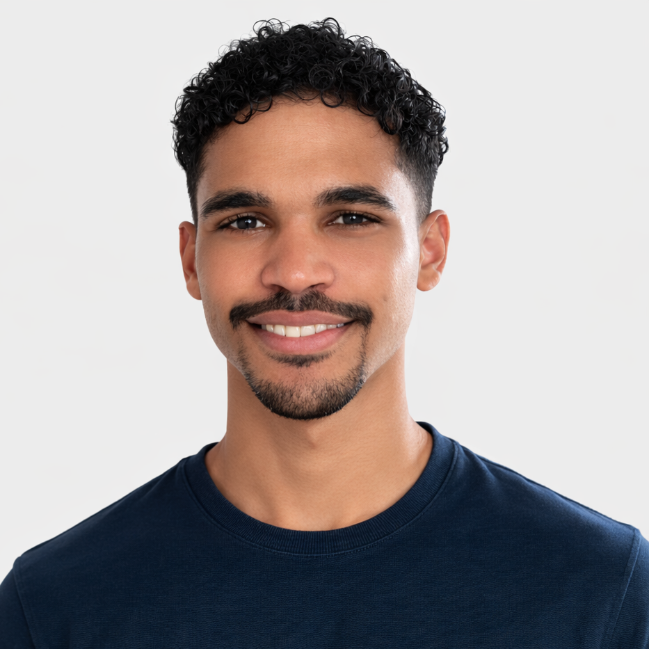

  

# Lyle Solomons👋

| 230123872@mycput.ac.za | [LinkedIn Profile](https://www.linkedin.com/in/lyle-solomons-9ab855296 ) | Western Cape, Cape Town, 7100 |

## 🎯 Career Overview
I am a 3rd year Application Development student at CPUT looking for a Work Integrated Learning opportunity where I can apply the technical skills I have developed through my studies in real world environments. I am eager to learn from industry professionals and grow as an ICT professional.

## 📚 Education

| LEAP Science and Maths School | National Senior Certificate |  |

| Cape Peninsula University of Technology | Higher Certificate in ICT (Cum Laude) |  |

| Cape Peninsula University of Technology | Diploma in Application Development |  |

## 💻 Academic Projects
### Student Management System – Java Application | 2025
- Worked in a team to develop a desktop-based Student Management System.
- Used Java and Java Swing to design and implement the graphical user interface.
- Applied object-oriented programming principles (classes, methods, encapsulation).
- Integrated SQL database functionality to store and retrieve structured data.
- Implemented input validation and basic error handling to improve system reliability.

**GitHub link:** [View Repository](https://github.com/sollyBug/Term4_ADP_Assignment.git)

### NSFAS App Redesign – UI\UX Project | 2025
- Completed a redesign proposal of the NSFAS mobile application as part of a university assignment.
- Analysed usability and interface challenges in the existing application
- Designed improved wireframes and high-fidelity prototypes using Figma
- Focused on improving layout clarity, user flow, and accessibility

**Figma Link:** [View Design](https://www.figma.com/design/2o459QPq1FgqfB1zrhvukq/Untitled?node-id=0-1&t=NA0VrRq1K0BuLqYw-1)

## 🔧 Technical Skills

#### 📝 Languages

#### 🌐 Web Technologies

#### 🛠 Tools & Platforms

## ⌯⌲ References
1. 👤 **Bhadra Ranchod**
   - Company: Cape Peninsula University of Technology
   - Contact: 082 495 9912
   - Email: ranchodb@cput.ac.za

2. 👤 **Richard Maliwata**
   - Company: Cape Peninsula University of Technology
   - Contact: 071 077 9922
   - Email: maliwatur@cput.ac.za
  
## 🗂️ Supporting documents
[View CV and Academic Record](230123872_CV_Academic_ID.pdf)

Mock Interview

  <video width="600" controls>
    <source src="mock_interview1.mp4" type="video/mp4">
    Your browser does not support the video tag.
  </video>

# 🧠 Reflections (using the STAR method)

## 👨‍💻 Coding in markdown
### Situation
I had an assignment to create a digital portfolio using GitHub and Markdown.

### Task
My task was to learn markdown's syntax and use it to code out my CV and display my mock interview video in a professional way.

### Action
I used the study guide provided by the lecturer and did my own research understand markdown's syntax better, which i used to organize my content clearly.

### Result
I created my portfolio which improved my ability to create documentation using markdown, which will be an important skill when working on GitHub projects in future

## 🎙️ Mock interview
### Situation
I was required to create a mock interview as part of my interview readiness training.

### Task
I needed to present myself professionally and answer questions all questions confidently on a video as if it was a real interview.

### Action
I prepared answers to common interview questions that I took out of the study guide, and practiced speaking clearly before making my video.

### Result
This experience helped improve my communication skills and how to structure my responses more effectively which i will need in real world interviews.

## 📄 GitHub pages
### Situation
I was required to publish my portfolio using GitHub Pages

### Task
My task was to deploy my GitHub repository as a live website and ensue that it can be viewed publicly.

### Action
I followed the rubric, ensured that I selected the correct branch with my README file, and ensured that my GitHub pages displayed online.

### Result
I published my GitHub portfolio as a live website. This experience helped me understand deployment using GitHub pages and how to make my work accessible to others online.
